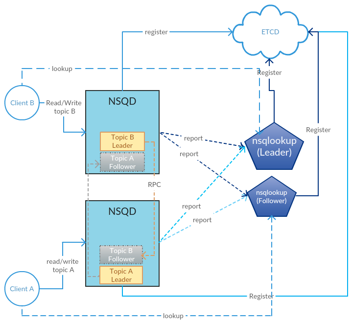

  <h1 align="center">NSQ 实时分布式消息平台</h1>
  

    <a href="README.md"><strong>English</strong></a> | <strong>简体中文</strong>
  

## 目录

- [仓库简介](#项目介绍)
- [前置条件](#前置条件)
- [镜像说明](#镜像说明)
- [获取帮助](#获取帮助)
- [如何贡献](#如何贡献)

## 项目介绍
‌[NSQ‌](https://github.com/nsqio/nsq) NSQ 是一个实时分布式消息平台，由 Bitly 开源，设计用于高吞吐量、低延迟的大规模消息处理。它具有轻量级、易部署、高可用等特点，适用于微服务架构、实时数据处理、事件驱动系统等场景。

**核心特性：**
1. 分布式消息队列架构：NSQ采用去中心化的分布式设计，无单点故障。消息通过topics和channels两级逻辑分离，支持多消费者组（订阅同一topic的多个channels），实现消息的广播或负载均衡。
2. 水平扩展与高可用：支持动态添加nsqd（消息处理节点）和nsqlookupd（服务发现节点），无需停机扩容。消息默认持久化到磁盘，即使节点重启也能保证数据不丢失。
3. 实时消息传递：采用推送（push）模式实时投递消息，低延迟（毫秒级）。消费者通过TCP长连接订阅消息，支持自动重连和消息超时机制，确保实时性。
4. 无单点依赖：不依赖ZooKeeper或etcd等外部协调服务，轻量级设计。nsqlookupd仅提供服务发现，故障时不影响已有nsqd和消费者的通信。
5. 消息可靠性保障：支持消息确认（ACK）机制，消费者处理成功后需显式ACK，否则消息会重新排队。提供最大尝试次数配置，避免死循环处理失败消息。
6. 协议简单易集成：基于HTTP/JSON的API管理接口，TCP协议传输消息。客户端支持多种语言（Go、Python、Java等），协议文档透明，便于二次开发。
7. 内存与磁盘混合存储：消息优先写入内存队列（高吞吐），超过内存阈值时自动切换到磁盘存储（高可靠）。支持配置内存队列大小和磁盘存储策略。
8. 灵活的消息格式：不强制约束消息格式，支持任意二进制数据（如JSON、Protocol Buffers等）。生产者与消费者自行协商编解码方式。
9. 动态拓扑发现：消费者通过nsqlookupd查询可用的nsqd节点列表，自动感知集群变化（如新增节点或节点下线），实现动态负载均衡。
10. 轻量级与低资源消耗：单个nsqd实例仅需少量CPU和内存资源（默认配置下约10MB内存），适合容器化部署和边缘计算场景。

本项目提供的开源镜像商品 [**`NSQ-实时分布式消息平台`**](https://marketplace.huaweicloud.com/hidden/contents/ee8d9c72-7cc3-4cc0-ad8b-b97aef5273ca#productid=OFFI1161477316831555584)，已预先安装 NSQ 软件及其相关运行环境，并提供部署模板。快来参照使用指南，轻松开启“开箱即用”的高效体验吧。

**架构设计：**

> **系统要求如下：**
> - CPU: 4vCPUs 或更高
> - RAM: 16GB 或更大
> - Disk: 至少 50GB

## 前置条件
[注册华为账号并开通华为云](https://support.huaweicloud.com/usermanual-account/account_id_001.html)

## 镜像说明

| 镜像规格                                                                                                                     | 特性说明 | 备注 |
|--------------------------------------------------------------------------------------------------------------------------| --- | --- |
| [NSQ1.3.0-kunpeng-v1.0](https://github.com/HuaweiCloudDeveloper/nsq-image/tree/NSQ1.3.0-kunpeng-v1.0?tab=readme-ov-file) | 基于鲲鹏服务器 + Huawei Cloud EulerOS 2.0 64bit 安装部署 |  |

## 获取帮助
- 更多问题可通过 [issue](https://github.com/HuaweiCloudDeveloper/nsq-image/issues) 或 华为云云商店指定商品的服务支持 与我们取得联系
- 其他开源镜像可看 [open-source-image-repos](https://github.com/HuaweiCloudDeveloper/open-source-image-repos)

## 如何贡献
- Fork 此存储库并提交合并请求
- 基于您的开源镜像信息同步更新 README.md